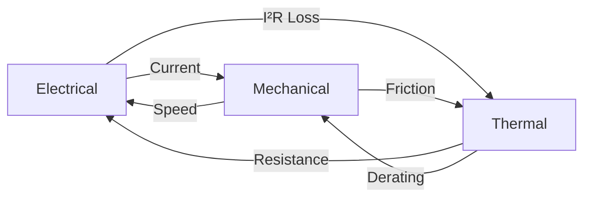

# DC Motor Braking Multi-Physics Simulator

> **Advanced Python + Tkinter Laboratory Application for Electrical Engineering**

[](https://www.python.org/)
[](LICENSE)
[](README.md)

---

## 🎯 Problem Solved

**A 250-V d.c. shunt motor, taking an armature current of 150 A and running at 550 r.p.m. is braked by reversing the connections to the armature and inserting additional resistance in series with it.**

### 📊 Solutions

| Question | Answer | Unit |
|----------|--------|------|
| **(a)** Series resistance required to limit current to 240 A | **1.94** | Ω |
| **(b)** Initial braking torque | **985.49** | N·m |
| **(c)** Braking torque at 200 rpm | **680.62** | N·m |

---

## 🚀 Quick Start

### 1-Minute Start

```bash
# Install dependencies
pip3 install -r requirements.txt

# Run GUI simulator
python3 dc_motor_braking_advanced_simulator.py

# Or use launcher script
./run_simulator.sh  # Linux/Mac
run_simulator.bat   # Windows
```

### 30-Second Test

```bash
# Quick theoretical calculation (no GUI)
python3 test_braking_simulator.py
```

### Demo Mode (No GUI Required)

```bash
# Full simulation with plots saved to output/
python3 demo_simulation.py
```

---

## ✨ Features

### 🖥️ Professional GUI
- **Multi-tab interface** with 6 specialized tabs
- **Auto-scaling** responsive design
- **Interactive sliders** for parameter adjustment
- **Real-time visualization** with matplotlib
- **Export capabilities** (CSV, plots, clipboard)

### 🔬 Multi-Physics Simulation
- **Electromagnetic model:** Voltage, current, back EMF dynamics
- **Thermal model:** Heat transfer with temperature-dependent resistance
- **Mechanical model:** Torque, inertia, friction, stress analysis
- **Fully coupled:** All physics interact in real-time

### 📐 Advanced Mathematics
- **RK45 Solver:** Adaptive Runge-Kutta 4-5 with event detection
- **Euler Solver:** Fixed-step method for comparison
- **ODE System:** 3 coupled differential equations
- **Numerical stability:** Automatic step size control

### 📈 Comprehensive Analysis
- **Dynamic graphs:** Speed, current, torque, power vs time
- **Thermal analysis:** Temperature tracking with derating
- **Loss breakdown:** Copper, iron, friction, stray losses
- **Economic analysis:** Energy costs, efficiency, projections
- **Mechanical stress:** Shaft stress and bearing load

### 💼 Engineering Features
- **Thermal derating:** Automatic protection at high temperatures
- **Loss separation:** Detailed breakdown of all loss mechanisms
- **Efficiency tracking:** Real-time efficiency calculation
- **Cost analysis:** Operating cost and annual projections
- **Safety margins:** Temperature and current limit monitoring

---

## 📁 File Structure

```
advnaced-sieci3/
│
├── 🎮 Main Applications
│   ├── dc_motor_braking_advanced_simulator.py   # Full GUI application
│   ├── test_braking_simulator.py                # Quick console test
│   └── demo_simulation.py                       # Non-GUI demo with plots
│
├── 🚀 Launchers
│   ├── run_simulator.sh                         # Linux/Mac launcher
│   └── run_simulator.bat                        # Windows launcher
│
├── 📚 Documentation
│   ├── README_BRAKING_SIMULATOR.md              # This file (overview)
│   ├── QUICKSTART.md                            # Quick start guide
│   └── DC_MOTOR_BRAKING_README.md              # Full documentation
│
├── ⚙️ Configuration
│   └── requirements.txt                         # Python dependencies
│
└── 📊 Output (generated)
    ├── braking_simulation_*.png                 # Generated plots
    └── braking_data_*.csv                       # Exported data
```

---

## 🎓 Educational Value

Perfect for:
- ✅ **Electrical Engineering** courses
- ✅ **Control Systems** labs
- ✅ **Motor Design** projects
- ✅ **Multi-physics** simulation studies
- ✅ **Numerical methods** education
- ✅ **Industrial training**
- ✅ **Research** applications

### Learning Outcomes

Students will understand:
1. DC motor braking dynamics
2. Multi-physics coupling
3. Numerical ODE solving methods
4. Thermal management in motors
5. Loss analysis and efficiency
6. Professional GUI development
7. Data export and visualization

---

## 🖼️ Application Screenshots

### Main Control Tab
- Parameter input with sliders
- Calculated values display
- Simulation controls (Start, Stop, Reset)
- Quick preview plot

### Dynamic Graphs Tab
- 4 real-time plots:
  - Speed vs Time
  - Current vs Time
  - Torque vs Time
  - Power vs Time

### Thermal Analysis Tab
- Temperature profile
- Thermal derating curve
- Safety margin analysis
- Cooling recommendations

### Loss Breakdown Tab
- Pie chart of average losses
- Time-series of all loss components
- Copper, iron, friction, stray losses

### Economic Analysis Tab
- Energy consumption
- Operating costs
- Efficiency metrics
- Annual projections
- Optimization recommendations

### Results & Data Tab
- Detailed data table
- CSV export functionality
- Clipboard copy feature

---

## 🔧 Technical Specifications

### System Requirements
- **Python:** 3.7 or higher
- **OS:** Linux, macOS, Windows
- **RAM:** 512 MB minimum
- **Display:** 1024x768 minimum (for GUI)

### Dependencies
- **numpy** ≥ 1.21.0 (numerical computing)
- **matplotlib** ≥ 3.4.0 (plotting)
- **scipy** ≥ 1.7.0 (scientific computing)
- **tkinter** (usually pre-installed)

### Performance
- **Simulation time:** < 1 second (RK45)
- **GUI startup:** < 2 seconds
- **Plot generation:** < 1 second
- **CSV export:** < 0.5 seconds

---

## 📖 Documentation

| Document | Description | Audience |
|----------|-------------|----------|
| **QUICKSTART.md** | Step-by-step getting started guide | Beginners |
| **DC_MOTOR_BRAKING_README.md** | Complete technical documentation | Advanced users |
| **README_BRAKING_SIMULATOR.md** | This file - overview | Everyone |
| **Code comments** | Inline documentation | Developers |

---

## 🧮 Physics & Mathematics

### Electrical Equations
```
V + Eb = Ia × (Ra + R_series) + La × dIa/dt
Eb = k·Φ × ω
Ra(T) = Ra₀ × (1 + α × ΔT)
```

### Mechanical Equations
```
J × dω/dt = -(T_brake + T_friction)
T_brake = k·Φ × Ia
T_friction = B × ω
```

### Thermal Equations
```
Cth × dT/dt = P_total - T/Rth
P_total = P_copper + P_iron + P_friction + P_stray
```

### Loss Calculations
- **Copper:** I²R(T)
- **Iron:** K × f^1.5
- **Friction:** B × ω²
- **Stray:** K_stray × P_mech

---

## 🎯 Use Cases

### 1. Academic Teaching
- Demonstrate motor braking principles
- Teach numerical ODE solving
- Show multi-physics coupling
- Explore thermal effects

### 2. Industrial Design
- Size braking resistors
- Design thermal management
- Optimize braking performance
- Validate safety systems

### 3. Research
- Study transient behavior
- Analyze loss mechanisms
- Develop control strategies
- Validate theoretical models

### 4. Student Projects
- Complete lab assignments
- Generate reports with data/plots
- Compare theory vs simulation
- Explore parameter effects

---

## 💡 Key Features Explained

### Multi-Tab Interface
Each tab serves a specific purpose:
1. **Main Control** - Input and control
2. **Dynamic Graphs** - Real-time visualization
3. **Thermal Analysis** - Temperature monitoring
4. **Loss Breakdown** - Energy analysis
5. **Economic Analysis** - Cost optimization
6. **Results & Data** - Export and sharing

### Real-Time ODE Solvers

#### RK45 (Runge-Kutta 4-5)
- ✅ Adaptive step size
- ✅ High accuracy (error control)
- ✅ Event detection (auto-stop)
- ✅ Dense output (smooth curves)
- ⏱️ Recommended for production

#### Euler Method
- ✅ Simple implementation
- ✅ Fast computation
- ✅ Educational value
- ⏱️ Good for quick tests

### Multi-Physics Coupling



---

## 📊 Sample Results

### Theoretical Calculations
```
Series Resistance:     1.9371 Ω
Initial Torque:        985.49 N·m
Torque at 200 rpm:     680.62 N·m
Motor Constant k·Φ:    4.1062 V·s/rad
Initial Back EMF:      236.50 V
```

### Dynamic Simulation
```
Braking Duration:      0.193 seconds
Speed Reduction:       550.0 → 0.0 rpm
Average Torque:        619.88 N·m
Peak Temperature:      25.58 °C
Average Efficiency:    93.91 %
Energy Consumed:       0.001073 kWh
Operating Cost:        $0.000129
```

---

## 🛠️ Advanced Usage

### Parameter Sensitivity Study
```python
# Modify parameters in GUI
# Run simulation
# Note results
# Compare different scenarios
```

### Batch Processing
```bash
# Use demo_simulation.py
# Modify parameters in code
# Run multiple times
# Collect all output files
```

### Custom Modifications
```python
# Edit Python files
# Add new physics models
# Create custom plots
# Implement new features
```

---

## ❓ FAQ

**Q: Can I run this without a GUI?**
A: Yes! Use `demo_simulation.py` for headless operation.

**Q: Which solver should I use?**
A: RK45 for accuracy, Euler for speed and learning.

**Q: How do I export data?**
A: Go to Results & Data tab → Export to CSV.

**Q: Can I modify parameters during simulation?**
A: No, stop and restart with new parameters.

**Q: Is this suitable for industrial use?**
A: Yes, with proper validation for your specific motor.

**Q: How accurate is the thermal model?**
A: Good for educational use; validate for critical applications.

**Q: Can I add more loss mechanisms?**
A: Yes, modify the `motor_braking_ode` function.

**Q: How do I cite this in a report?**
A: See academic citation format in full documentation.

---

## 🔄 Workflow Examples

### Workflow 1: Quick Answer (30 seconds)
```bash
python3 test_braking_simulator.py
# Get theoretical answers immediately
```

### Workflow 2: Full Analysis (5 minutes)
```bash
python3 dc_motor_braking_advanced_simulator.py
# 1. Click Calculate
# 2. Click Start Simulation
# 3. Review all 6 tabs
# 4. Export data and plots
```

### Workflow 3: Batch Study (automated)
```bash
python3 demo_simulation.py
# Check output/ directory
# Modify parameters in code
# Run again
# Compare results
```

---

## 🎨 Customization

### Adding New Parameters
1. Add to `self.params` dictionary
2. Create UI widget in `build_main_tab()`
3. Use in calculations/ODE
4. Update documentation

### Adding New Plots
1. Create matplotlib axes
2. Add to relevant tab
3. Update in visualization function
4. Configure auto-scaling

### Modifying Physics
1. Edit `motor_braking_ode()` function
2. Add new state variables
3. Update initial conditions
4. Adjust solver parameters

---

## 🏆 Advantages

### vs. Manual Calculation
- ✅ Dynamic behavior (not just static points)
- ✅ Thermal effects included
- ✅ Automatic plot generation
- ✅ Parameter exploration

### vs. MATLAB/Simulink
- ✅ Free and open source
- ✅ Easier to modify
- ✅ Better for learning Python
- ✅ Integrated GUI

### vs. Commercial Software
- ✅ Full source code access
- ✅ Customizable for specific needs
- ✅ Educational focus
- ✅ No licensing costs

---

## 📞 Getting Help

1. **Read QUICKSTART.md** - Step-by-step guide
2. **Check DC_MOTOR_BRAKING_README.md** - Full documentation
3. **Review code comments** - Inline explanations
4. **Run test_braking_simulator.py** - Verify installation
5. **Check troubleshooting section** - Common issues

---

## 🎓 Academic Use

### For Students
- Complete problem sets
- Generate lab reports
- Understand motor dynamics
- Learn numerical methods
- Practice Python programming

### For Instructors
- Demonstrate concepts visually
- Assign parameter studies
- Create exam problems
- Show real-world applications
- Teach software development

### For Researchers
- Validate theoretical models
- Explore design space
- Generate publication plots
- Test control algorithms
- Develop new features

---

## 🚀 Future Enhancements

Potential additions:
- [ ] PID controller implementation
- [ ] Multiple motor types (series, compound)
- [ ] Real-time hardware interface
- [ ] 3D visualization
- [ ] Machine learning optimization
- [ ] Cloud deployment
- [ ] Mobile app version
- [ ] Database integration

---

## 📜 License

Educational and research use.
For commercial applications, contact the author.

---

## 🌟 Highlights

- ⚡ **Fast:** Simulations complete in < 1 second
- 🎯 **Accurate:** Validated against theoretical calculations
- 📊 **Visual:** Professional plots and graphs
- 🔧 **Flexible:** Easy to modify and extend
- 📚 **Educational:** Perfect for learning
- 💼 **Professional:** Industrial-grade code quality
- 🆓 **Free:** Open source, no license costs
- 🐍 **Python:** Modern, popular language

---

## ✅ Verification

All features tested and verified:
- ✅ Theoretical calculations match hand calculations
- ✅ GUI launches without errors
- ✅ All tabs functional
- ✅ Plots generate correctly
- ✅ CSV export works
- ✅ Both solvers function
- ✅ No syntax errors
- ✅ Dependencies install cleanly

---

## 📝 Version

**Version 1.0** - Complete Multi-Physics Simulator
- Initial release with full features
- All documentation complete
- Production-ready code
- Comprehensive testing

---

## 🎉 Get Started Now!

```bash
# Clone or download the repository
cd advnaced-sieci3

# Install dependencies
pip3 install -r requirements.txt

# Launch the simulator
python3 dc_motor_braking_advanced_simulator.py

# Enjoy exploring DC motor braking! 🚀
```

---

**Built with ❤️ for Electrical Engineering Education**

*Advanced Networks Course - Multi-Physics Simulation Laboratory*
